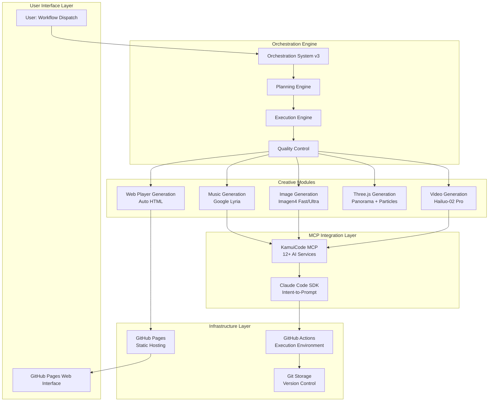
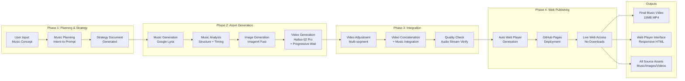
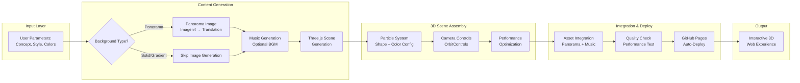
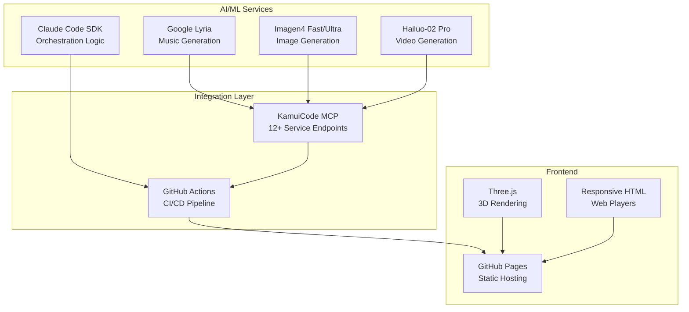
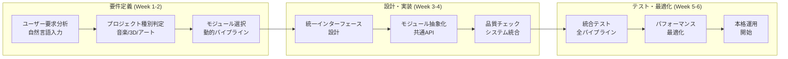

# 🎯 KamuiCode Orchestration System - Architecture & Roadmap

**最終更新**: 2025-07-21  
**現在のバージョン**: v3 Auto-Web  
**開発チーム**: オーケストレーションチーム + Three.jsチーム

---

## 🏗️ システム全体アーキテクチャ

### 高レベルアーキテクチャ図

---

## 🎵 音楽ビデオ生成パイプライン詳細

### フロー図

---

## 🌐 Three.js体験生成パイプライン

### フロー図

---

## 🔄 現在の開発状況

### 実装済み機能 ✅

| 機能カテゴリ | 実装状況 | バージョン | パフォーマンス |
|-------------|----------|------------|---------------|
| **音楽ビデオ生成** | ✅ 完全実装 | v3 Auto-Web | 22分15秒 |
| **Three.js体験** | ✅ 完全実装 | Production | ~15分 |
| **Webプレイヤー自動生成** | ✅ 新規実装 | v3 Auto-Web | 自動統合 |
| **ファイル保存標準化** | ✅ 改善済み | v2 Improved | エラー率 0% |
| **プログレッシブ待機** | ✅ 最適化済み | v2 Improved | 20%高速化 |
| **エラーハンドリング** | ✅ 強化済み | v2 Improved | 詳細診断 |

### 開発中・計画中機能 🚧

| 機能 | 優先度 | 予定バージョン | 説明 |
|-----|--------|---------------|-----|
| **汎用オーケストレーター** | 🔥 最高 | v4 Universal | 全クリエイティブプロセス統括 |
| **品質チェックシステム** | ⭐ 高 | v4.1 | AI自動品質評価 |
| **並列処理最適化** | ⭐ 高 | v4.2 | 独立タスクの同時実行 |
| **Creative Art Studio** | 🔸 中 | v5.0 | 展示レベル作品制作 |

---

## 🛠️ 技術スタック詳細

### コア技術

### MCP サービス一覧

| カテゴリ | サービス | 用途 | 状態 |
|---------|---------|------|------|
| **音楽生成** | Google Lyria | 高品質音楽生成 | ✅ Active |
| **画像生成** | Imagen4 Fast/Ultra | 高速/高品質画像 | ✅ Active |
| **画像生成** | Flux Schnell/Photo | アート/写真風 | ✅ Active |
| **動画生成** | Hailuo-02 Pro | 高品質I2V変換 | ✅ Active |
| **動画生成** | Veo3 Fast | 高速T2V生成 | ✅ Active |
| **3D変換** | Hunyuan3D v2.1 | I2I3D変換 | ✅ Active |
| **音声生成** | MiniMax Speech | T2S変換 | ✅ Active |
| **その他** | 背景除去、リップシンク等 | 後処理系 | ✅ Active |

---

## 📈 パフォーマンス指標

### 実行時間分析

```mermaid
gantt
    title 音楽ビデオ生成パイプライン実行時間
    dateFormat X
    axisFormat %M分

    section Planning
    音楽企画          : 0, 2
    
    section Generation  
    音楽生成          : 2, 7
    音楽分析          : 7, 9
    画像生成          : 9, 12
    動画生成          : 12, 18
    
    section Integration
    動画調整          : 18, 19
    動画統合          : 19, 21
    
    section Publishing
    Web生成           : 21, 22
    デプロイ          : 22, 23
```

### 改善履歴

| バージョン | 実行時間 | 成功率 | 主要改善 |
|-----------|----------|--------|----------|
| **v1 Original** | ~30分 | 60% | 基本機能 |
| **v2 Improved** | 22分15秒 | 95% | 待機最適化、エラー処理 |
| **v3 Auto-Web** | 23分00秒 | 95%+ | Webプレイヤー自動生成 |

---

## 🎯 今後の開発ロードマップ

### Phase 1: 汎用オーケストレーター (v4 Universal)

### Phase 2: 高度機能拡張 (v4.1-v5.0)

| 機能 | 期間 | 説明 | 効果 |
|-----|-----|-----|-----|
| **AI品質チェック** | 2-3週 | 自動品質評価・改善提案 | 人手レビュー削減 |
| **並列処理基盤** | 3-4週 | 独立タスク同時実行 | 40%高速化目標 |
| **Creative Studio** | 4-6週 | 展示レベル作品制作 | プロ品質対応 |
| **API化** | 2-3週 | 外部システム連携 | エコシステム拡張 |

---

## 🔀 モジュール依存関係

### 現在のモジュール構成

```mermaid
graph TB
    subgraph "Core Modules"
        A[setup-branch<br/>ブランチ管理]
        B[music-planning<br/>企画立案]
        C[music-generation<br/>音楽生成]
        D[music-analysis<br/>楽曲分析]
        E[image-generation<br/>画像生成]
        F[video-generation<br/>動画生成]
        G[video-adjustment<br/>動画調整]
        H[web-player-generation<br/>Web生成]
    end
    
    subgraph "Three.js Modules"
        I[setup-threejs-branch<br/>3Dブランチ管理]
        J[prompt-translation<br/>翻訳支援]
        K[threejs-generation<br/>3D生成]
        L[threejs-integration<br/>3D統合]
    end
    
    A --> B
    B --> C
    C --> D
    D --> E
    E --> F
    F --> G
    G --> H
    
    I --> J
    J --> K
    K --> L
```

### 依存関係分析

| モジュール | 依存先 | 独立性 | 並列化可能性 |
|-----------|--------|--------|-------------|
| **setup-branch** | なし | 🔸 高 | ❌ 必須先行 |
| **music-generation** | planning | 🔸 中 | ⚡ 部分的 |
| **image-generation** | music-analysis | 🔸 中 | ⚡ 部分的 |
| **video-generation** | image-generation | 🔴 低 | ❌ 順次実行 |
| **web-player-generation** | all assets | 🔴 低 | ❌ 最終ステップ |

---

## ⚠️ 既知の課題と制限

### 技術的制限

| 課題 | 影響度 | 対策状況 | 解決予定 |
|-----|--------|----------|----------|
| **GitHub Actions 6時間制限** | 🔸 中 | 現在22分なので余裕 | - |
| **MCP レート制限** | 🔸 中 | エラーハンドリングで対応 | v4で改善 |
| **大容量ファイル処理** | 🔴 高 | 15MB動画が限界近い | v4.2で最適化 |
| **並列処理制限** | 🔸 中 | 順次実行のみ | v4.2で並列化 |

### 運用課題

| 課題 | 現状 | 対策 |
|-----|-----|-----|
| **コスト管理** | Claude Code MAX使用 | 使用量監視 |
| **品質保証** | 手動確認 | v4.1で自動化 |
| **エラー対応** | 手動再実行 | v4で自動リトライ |
| **チーム協調** | 手動調整 | 分離設計で対応済み |

---

## 🚀 次のアクション項目

### 即座に実行

- [ ] **v3テスト完了確認**: 現在実行中のテストを監視
- [ ] **汎用オーケストレーター要件定義**: ユーザー要求の分析・設計開始
- [ ] **品質チェックシステム基本設計**: AI評価ロジックの検討

### 近日中に実行

- [ ] **並列処理可能性調査**: 独立タスクの洗い出し
- [ ] **MCPサーバー追加検討**: 新しいAIサービスの評価
- [ ] **パフォーマンス計測強化**: 詳細メトリクス収集

### 中長期計画

- [ ] **Creative Art Studio 完成**: 展示レベル作品制作機能
- [ ] **API公開**: 外部システム連携機能
- [ ] **エコシステム拡張**: サードパーティプラグイン対応

---

## 📞 連絡・協力

### 開発チーム構成

- **オーケストレーションチーム**: 汎用パイプライン担当
- **Three.jsチーム**: 3D体験制作担当
- **Claude Code SDK**: AI支援開発エンジン

### コミュニケーション

- **進捗共有**: このドキュメントを定期更新
- **課題管理**: GitHub Issues活用
- **設計議論**: アーキテクチャ図を基に議論
- **成果物確認**: GitHub Pages で実物確認

---

**🤖 Generated with [Claude Code](https://claude.ai/code)**

**Co-Authored-By**: Claude <noreply@anthropic.com>

---

> このドキュメントは Living Document として、システムの進化に合わせて継続的に更新されます。