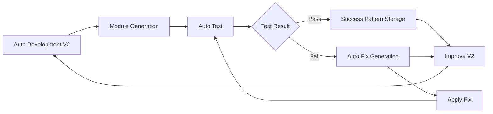

# AI駆動エラー修正戦略

**Summary**: Auto Development V2で生成されたモジュールの自動テスト・修正システム設計  
**Tags**: #ai-driven-testing #error-correction #auto-development-v2 #feedback-loop  
**Related**: [error-prevention-checklist.md], [debugging-lessons-from-agents.md]  
**AI Usage**: 生成されたモジュールのテスト失敗時に自動修正フローを実行するため  
**Date**: 2025-01-27  
**Status**: active  

## 🎯 現在の課題

### Auto Development V2の課題
- **image-generation-multi**: 生成完了、テスト未合格
- **フィードバック不足**: 生成後のテスト結果が次の生成に活かされない
- **学習データ不足**: 前任者のエラー予防知識が活用されていない

## 🚀 AI駆動修正フロー設計

### Phase 1: 自動テスト実行
```yaml
test_workflow: "create-music-video-multi-image.yml"
test_parameters:
  music_concept: "simple test"
  image_count: "1"
  models: "imagen4-fast"
  enable_comparison: "false"
```

### Phase 2: エラー分析・修正生成
```yaml
error_analysis_prompt: |
  Generated module test failed. Analyze logs and create fix.
  
  Input:
  - Test execution logs
  - Module source code
  - Error prevention knowledge from ai-memory/
  
  Output:
  - Root cause analysis
  - Specific fixes required
  - Updated module code
```

### Phase 3: 修正版テスト・反復
```yaml
iterative_testing:
  max_attempts: 3
  validation_criteria:
    - All tests pass
    - No regression in existing functionality
    - Performance within acceptable limits
```

## 🔄 自動修正ワークフロー設計

### auto-test-and-fix.yml
```yaml
name: Auto Test and Fix Generated Module

on:
  workflow_dispatch:
    inputs:
      target_module:
        description: 'Target module to test and fix'
        required: true
        default: 'image-generation-multi'
      test_workflow:
        description: 'Test workflow to use'
        required: true
        default: 'create-music-video-multi-image.yml'

jobs:
  test-and-fix:
    runs-on: ubuntu-latest
    steps:
      - name: Run Initial Test
        # Execute test workflow
        
      - name: Analyze Failures (if any)
        # AI analysis of test logs
        
      - name: Generate Fix
        # AI修正コード生成
        
      - name: Apply Fix and Retest
        # 修正適用・再テスト
        
      - name: Update Auto Development V2
        # フィードバック反映
```

## 📚 前任者知識の活用

### エラー予防ファイル生成
**`ai-memory/pre-development-checklist.md`**:
```markdown
# Auto Development V2 事前チェックリスト

## GitHub Actions YAML生成時の必須確認
- `if:` 条件は `${{ }}` で囲む
- output名・env変数名にハイフン禁止
- データフロー追跡の重要性
- シンプルソリューション優先

## MCP統合時の注意点
- サービス名の正確性確保
- エラーハンドリング実装
- 段階的統合テスト
```

## 🎯 Auto Development V2への改善提案

### 1. 事前学習フェーズ追加
```yaml
- name: Pre-Development Learning
  run: |
    # ai-memory/ の知識を読み込み
    # エラー予防チェックリストを適用
    # 前回の失敗事例を学習
```

### 2. テスト駆動生成
```yaml
- name: Generate with Test-First Approach
  run: |
    # テストケース先行生成
    # テストに合格するコード生成
    # 段階的統合テスト実行
```

### 3. 自動修正ループ
```yaml
- name: Auto-Fix Loop
  run: |
    # テスト実行
    # 失敗時は自動分析・修正
    # 最大3回まで自動修正
    # 成功時はフィードバック蓄積
```

## 📊 学習データ蓄積戦略

### 成功・失敗パターンの記録
```yaml
feedback_data:
  success_patterns:
    - 使用した技術スタック
    - 生成されたコードパターン
    - テスト通過時の設定
    
  failure_patterns:
    - 失敗の根本原因
    - 修正方法
    - 予防策
```

### 次回生成への反映
```yaml
learning_integration:
  - 成功パターンのテンプレート化
  - 失敗パターンの自動回避
  - 品質向上の段階的実現
```

## 🎯 実装優先度

### 即座に実行
1. **既存テスト実行**: create-music-video-multi-image.yml
2. **エラー特定**: 具体的な失敗箇所の把握
3. **手動修正**: 初回学習データ作成

### 短期実装（1-2週間）
1. **auto-test-and-fix.yml**: 自動テスト・修正ワークフロー
2. **前任者知識統合**: エラー予防チェックリスト活用
3. **Auto Development V2改善**: 事前学習フェーズ追加

### 中期実装（2-4週間）
1. **完全自動修正ループ**: テスト失敗→修正→再テストの自動化
2. **学習データ蓄積**: 成功・失敗パターンの体系化
3. **品質保証システム**: AI生成コードの品質向上

## 🔄 フィードバックループ設計



---

**この戦略により、Auto Development V2は失敗から学習し、次回はより高品質なモジュールを生成できるようになります。**