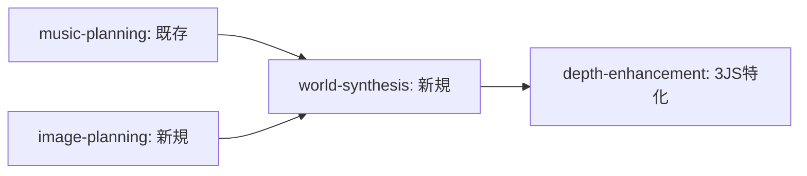

# Image Planning Module Analysis

**Date**: 2025-01-26  
**Test Status**: ✅ Success (Run ID: 16537044455)  
**Purpose**: AI駆動開発システム構築のための学習データ

## Module Overview

### Basic Info
- **Name**: `image-planning`
- **Purpose**: 画像プロンプト → 世界観分析
- **Integration Pattern**: music-planning + image-planning → world-synthesis → depth-enhancement

### Evolution Context


## Technical Analysis

### Input/Output Pattern
```yaml
inputs:
  content_prompt: "image-prompt"
  storage: "folder-name"
  standard: ["branch-name", "oauth-token"]

outputs:
  structured_data: "JSON (machine processing)"
  human_readable: "Markdown (human review)"
  config_values: "TXT (system integration)"
```

### World Analysis Framework
```yaml
analysis_dimensions:
  scene_type: ["static", "dynamic", "dramatic"]
  atmosphere: ["peaceful", "energetic", "mysterious", ...]
  depth_mode: ["normal", "enhanced"]
  lighting_style: ["soft", "bright", "dramatic", ...]
  movement_energy: "1-10 scale"
  color_temperature: ["warm", "cool", "neutral"]
```

## AI Generation Insights

### Reusable Template Pattern
```yaml
template_name: "[Medium]-Planning Module"

structure:
  name: "[Medium] World Analysis"
  description: "Analyze [medium] prompts to extract world atmosphere"
  
  inputs:
    - "[medium]-prompt": "分析対象"
    - "folder-name": "出力場所"
    - standard_params: ["branch-name", "oauth-token"]
    
  outputs:
    - analysis_dimensions: "6-8項目の体系的分析"
    - file_triad: "[JSON, Markdown, Config]"
    
  specialization_hook:
    - "[target]-optimization": "特定技術への最適化指示"
```

### Specialization Strategy
```yaml
universality_levels:
  high_reuse: 
    - "world analysis framework"
    - "multi-format output pattern"
    - "file organization structure"
    
  domain_specific:
    - "3JS point cloud optimization"
    - "360-degree panorama consideration"
    
  expandable:
    - "video-planning: temporal_flow, scene_transitions"
    - "voice-planning: vocal_emotion, speech_pace"
```

## Integration Preparation

### World Synthesis Integration Points
```yaml
data_flow:
  from_image_planning:
    format: "JSON structured analysis"
    dimensions: 6
    confidence_scoring: true
    
  to_world_synthesis:
    challenge: "conflict resolution needed"
    examples:
      - "atmosphere: peaceful(image) vs energetic(music)"
      - "color_temperature: warm(image) vs cool(music)"
    
  resolution_strategy:
    - priority_rules: "TBD"
    - blend_algorithms: "TBD"
    - confidence_weighting: "analysis.confidence値活用"
```

## Test Results Analysis

### Success Factors
1. **JSON Structure Validation**: Fixed syntax error → success
2. **Multi-format Output**: JSON + Markdown + TXT generation
3. **Claude Code Integration**: 15 turns, bypass permissions
4. **Git Integration**: Automatic commit/push

### Error Pattern (Fixed)
```
Before: JSON format syntax error
After: Proper JSON structure validation
Learning: Include syntax validation in AI generation templates
```

## Future Applications

### Expandable Patterns for AI Generation
```yaml
video_planning_prediction:
  new_dimensions: ["temporal_flow", "scene_transitions", "narrative_arc"]
  optimization_target: "video editing software"
  
voice_planning_prediction:  
  new_dimensions: ["vocal_emotion", "speech_pace", "background_ambience"]
  optimization_target: "voice synthesis + BGM integration"
  
music_planning_comparison:
  status: "existing (can be compared)"
  expected_dimensions: ["rhythm", "harmony", "emotional_tone"]
```

## AI Automation Templates

### For DeveloperAI
```yaml
when_asked_to_create: "[medium]-planning module"
use_template: "image-planning pattern"
customize:
  - analysis_dimensions: "adapt to medium characteristics"
  - optimization_target: "specify target application"
  - output_format: "maintain JSON + Markdown + Config triad"
```

### For TestAI
```yaml
validation_checklist:
  - JSON syntax validation
  - File triad generation (JSON + MD + TXT)
  - Claude Code SDK integration (15 turns max)
  - Git operations (commit + push)
  - Output value extraction and GitHub Output setting
```

---

## Next Research Items
1. music-planning output format analysis
2. world-synthesis integration logic study  
3. depth-enhancement specialization boundary mapping

*This analysis serves as learning data for future AI-driven development automation*