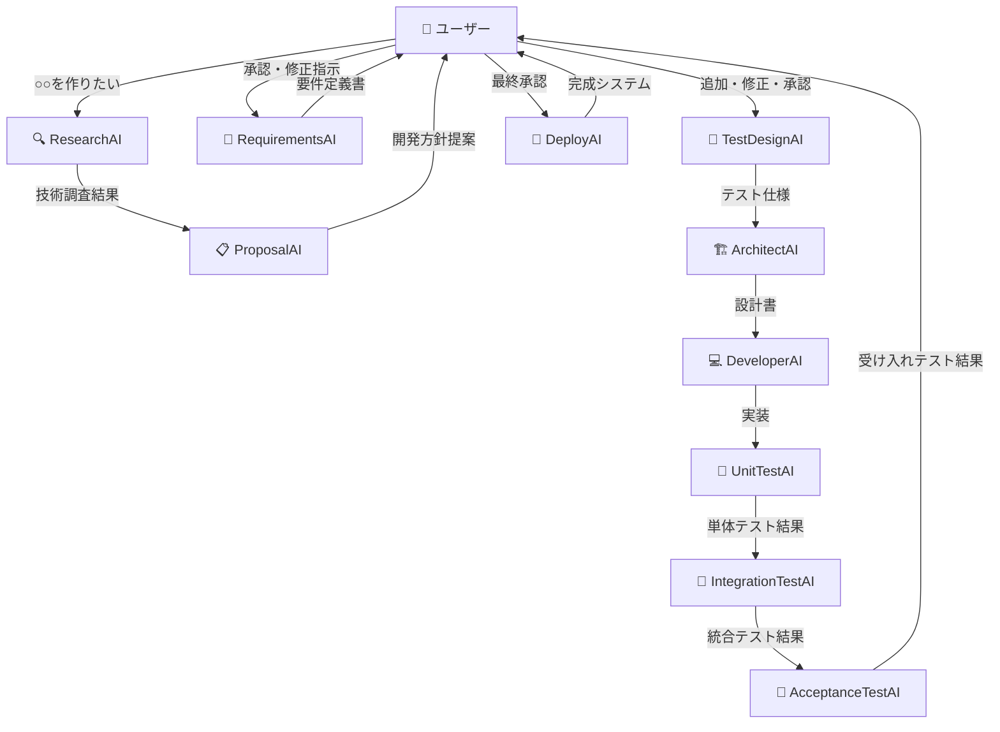

# AI駆動開発システム構想

**日付**: 2025-01-26  
**ステータス**: 構想設計  
**目的**: 完全AI駆動開発システムの将来ビジョン

## ビジョン概要

### 理想的な開発フロー
```
ユーザー: 「○○を作りたい」
↓
AIチームが自律的に開発
↓
人間は重要な判断ポイントのみ関与
↓
完成したシステムがデプロイ
```

**目標**: 人間の作業を要件伝達と重要判断のみに最小化し、技術実装はAIが完全自動化

## AI開発チーム構成

### 1. ResearchAI 🔍
```yaml
役割: "技術調査・実現可能性分析"
機能:
  - 最新技術動向調査
  - 実現可能性評価
  - リスク分析
  - 推奨技術スタック提案
  
出力: "技術調査レポート + 実現可能性スコア"
```

### 2. ProposalAI 📋
```yaml
役割: "開発方針提案・アプローチ決定"
機能:
  - ResearchAI結果の分析
  - 開発アプローチ提案
  - プロジェクト計画立案
  - コスト・時間見積もり
  
出力: "開発方針提案書 + プロジェクト計画"
```

### 3. RequirementsAI 📝
```yaml
役割: "詳細要件定義書作成"
機能:
  - ユーザー要望の詳細化
  - 機能要件・非機能要件整理
  - 受け入れ基準定義
  - ワークフロー図作成
  
出力: "詳細要件定義書 + 受け入れ基準"
```

### 4. ArchitectAI 🏗️
```yaml
役割: "システム設計・アーキテクチャ決定"
機能:
  - システムアーキテクチャ設計
  - モジュール分割
  - インターフェース設計
  - 技術選定
  
出力: "設計書 + アーキテクチャ図"
```

### 5. DeveloperAI 💻
```yaml
役割: "実装・コード生成"
機能:
  - コード自動生成
  - モジュール実装
  - API実装
  - データベース設計実装
  
出力: "動作するコード + ドキュメント"
```

### 6. TestAI (3分割) 🧪

#### UnitTestAI
```yaml
役割: "単体テスト"
対象: "個別機能・メソッド"
並列性: "並列実装数分のAIが必要"
```

#### IntegrationTestAI  
```yaml
役割: "統合テスト"
対象: "モジュール間連携"
数量: "プロジェクト数分"
```

#### AcceptanceTestAI
```yaml
役割: "受け入れテスト"
対象: "ユーザーシナリオ"
数量: "サービス/ユーザー種別数分"
```

## 対話型開発フロー

### 完全フロー図


### 人間のチェックポイント
```yaml
checkpoint_1:
  name: "初期要望伝達"
  type: "必須"
  content: "何を作りたいかの伝達"
  
checkpoint_2:
  name: "開発方針確認"
  type: "必須"
  content: "技術アプローチ・予算・スケジュール承認"
  
checkpoint_3:
  name: "要件定義確認"
  type: "必須"
  content: "詳細要件の追加・修正・最終承認"
  
checkpoint_4:
  name: "テスト結果確認"
  type: "オプション"
  content: "品質確認（自動でも可能）"
  
checkpoint_5:
  name: "最終承認"
  type: "必須"
  content: "デプロイ・本番公開の承認"
```

## V字モデル + テスト駆動開発

### 設計思想
```yaml
methodology: "V字モデル + テスト駆動開発"
principle: "師匠の教え: 要件定義→実装、ウォーターフォールでやる、テスト駆動"

v_model_structure:
  left_side:
    - 要件定義: "RequirementsAI"
    - 外部設計: "ArchitectAI" 
    - 内部設計: "ArchitectAI詳細"
    - 実装: "DeveloperAI"
    
  right_side:
    - 受け入れテスト: "AcceptanceTestAI"
    - システムテスト: "IntegrationTestAI"
    - 単体テスト: "UnitTestAI"
```

### テスト駆動アプローチ
```yaml
test_first_development:
  1. TestDesignAI: "全テスト仕様を事前作成"
  2. ArchitectAI: "テスト仕様に基づく設計"
  3. DeveloperAI: "テストが通るように実装"
  4. TestAI群: "仕様通りの動作確認"

benefit: "手戻りを最小化し、品質を保証"
```

## AI間連携プロトコル

### データ受け渡し標準
```yaml
handoff_protocol:
  format: "標準化JSON"
  
  research_to_proposal:
    data: [technical_findings, feasibility_score, recommended_stack, risk_assessment]
    
  proposal_to_requirements:
    data: [approved_approach, user_feedback, constraints, timeline]
    
  requirements_to_architect:
    data: [finalized_requirements, acceptance_criteria, workflow_diagram]
    
  architect_to_developer:
    data: [system_design, module_specifications, interface_definitions]
    
  developer_to_test:
    data: [implementation_artifacts, test_data, deployment_instructions]
```

### 状態管理システム
```yaml
shared_state:
  current_phase: "requirements/design/implementation/testing"
  project_context: "全AIが参照可能なプロジェクト情報"
  decisions_log: "重要な判断の履歴"
  errors_log: "発生した問題とその解決"
  human_feedback: "人間からのフィードバック蓄積"
```

## エラー処理・品質保証

### 無限ループ対策
```yaml
retry_limit_system:
  max_attempts: 3
  escalation_trigger: "3回失敗で人間エスカレーション"
  
modification_tracking:
  hash_comparison: "前回修正との比較で同一修正検出"
  loop_detection: "循環修正パターンの特定"
  
circuit_breaker:
  failure_threshold: "1時間で5回失敗"
  cooldown_period: "1時間の自動修正停止"
```

### 段階的エスカレーション
```yaml
escalation_levels:
  level_1: "AI自動修正（3回まで）"
  level_2: "Issue自動作成・開発者通知"
  level_3: "人間判断待ちモード"
  level_4: "緊急人間介入要請"

escalation_triggers:
  - "同一エラーの繰り返し"
  - "修正試行回数限界"
  - "Critical系エラー"
  - "セキュリティ関連問題"
```

## 段階的実装ロードマップ

### Phase 1: 基本対話型（3ヶ月目標）
```yaml
scope: "最小限の対話型開発"
components:
  - RequirementsAI: "対話で要件収集"
  - DeveloperAI: "基本的な実装"
  - ValidatorAI: "統合テスト"
  
automation_level: "50%"
human_involvement: "要件確認・最終承認"
```

### Phase 2: フル対話型（6ヶ月目標）
```yaml
scope: "完全AI開発チーム"
components:
  - ResearchAI + ProposalAI: "技術調査・提案"
  - RequirementsAI: "詳細要件定義"
  - ArchitectAI: "システム設計"
  - DeveloperAI: "実装"
  - TestAI (3分割): "包括的テスト"
  
automation_level: "80%"
human_involvement: "各フェーズのチェックポイント"
```

### Phase 3: 自律型（1年目標）
```yaml
scope: "完全自律開発システム"
automation_level: "95%"
human_involvement: "初期要望・最終承認のみ"

advanced_features:
  - 自動品質評価
  - 自動パフォーマンス最適化
  - 自動セキュリティ監査
  - 自動デプロイ・運用監視
```

## 技術基盤

### 現在の実装基盤
```yaml
foundation:
  execution_environment: "GitHub Actions"
  ai_engine: "Claude Code SDK"
  integration_protocol: "MCP (Model Context Protocol)"
  version_control: "Git"
  
proven_components:
  - image-planning: "画像分析モジュール"
  - music-planning: "音楽分析モジュール"  
  - world-synthesis: "マルチモーダル統合"
  - 段階的統合テスト: "A→B→C検証手法"
```

### 拡張予定技術
```yaml
future_technology:
  ai_orchestration: "AI間自動連携システム"
  natural_language_interface: "自然言語でのAI指示"
  dynamic_pipeline: "要件に応じた自動パイプライン構築"
  quality_ai: "AI駆動品質保証システム"
```

## 実用化シナリオ

### 対象プロジェクト
```yaml
current_application:
  - "GitHub Actionsモジュール開発"
  - "クリエイティブワークフロー構築"
  - "マルチメディア統合システム"
  
future_application:
  - "Webアプリケーション開発"
  - "APIサービス構築"
  - "データ分析パイプライン"
  - "MLシステム開発"
```

### 成功指標
```yaml
success_metrics:
  development_speed: "従来の5倍以上"
  human_workload: "80%削減"
  code_quality: "自動テストカバレッジ95%以上"
  bug_rate: "従来の50%以下"
  user_satisfaction: "要件通りの成果物90%以上"
```

## 長期ビジョン

### 5年後の目標
```yaml
ultimate_vision: "考えるだけでソフトウェアが完成する世界"

capabilities:
  - 自然言語要求から完全システム生成
  - リアルタイム要件変更対応
  - 自動運用・保守・改善
  - 複数プロジェクト並列開発
  - 人間のクリエイティブワークへの集中
```

### 社会的インパクト
```yaml
impact:
  democratization: "プログラミング知識不要でソフトウェア開発"
  productivity: "開発生産性の革命的向上"
  innovation: "アイデアから実装までの時間短縮"
  accessibility: "技術の民主化・アクセシビリティ向上"
```

---

## 実装アクション

### 次の具体的ステップ
```yaml
immediate_actions:
  1. "現在の成功パターン（マルチモーダル統合）の完全テンプレート化"
  2. "RequirementsAI + DeveloperAI の基本対話実装"
  3. "段階的テスト手法の標準化"
  4. "AI間連携プロトコルの実装"

6month_goals:
  1. "Phase 1システムの完成・実用化"
  2. "複数のユースケースでの実証実験"
  3. "AI開発チーム全体の統合"
  4. "品質保証システムの確立"
```

**この構想は、現在のマルチモーダル統合成功を基盤として、段階的に実現可能な AI駆動開発の未来を描いています。**

*人間がアイデアを考え、AIが技術実装を担う - 真のクリエイティブ・技術分離を実現する革命的システムです。*